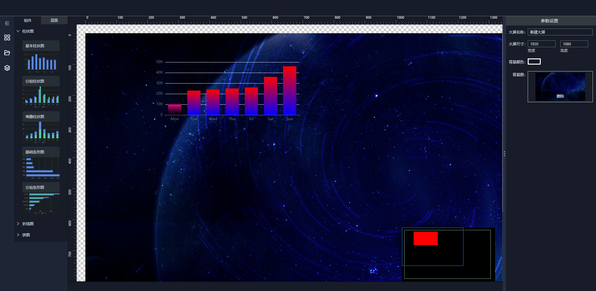

## 预览

<p align="center">
  
</p>
## 项目用到的一些库

> 组件移动(https://github.com/daybrush/moveable)

> 组件多选(https://github.com/daybrush/selecto)

> 标尺(https://github.com/daybrush/guides)

> hook 库 [alibaba/hooks](https://github.com/alibaba/hooks)，
> [官网](https://ahooks.gitee.io/zh-CN)

> 图表库 [echarts](https://echarts.apache.org/zh/index.html)，
> (dataV)(http://datav-react.jiaminghi.com/)

> 更改数据副本而不更改原始源 [immutability-helper] (https://github.com/kolodny/immutability-helper)

> [颜色选择器](https://github.com/casesandberg/react-color)，
> [官网](http://casesandberg.github.io/react-color/)

> [fast-deep-equal 数据比较](https://github.com/epoberezkin/fast-deep-equal)

## 使用

```bash
# 安装依赖
$ yarn || npm install

# 启动服务
$ yarn start || npm run start  # visit http://localhost:3000
```
